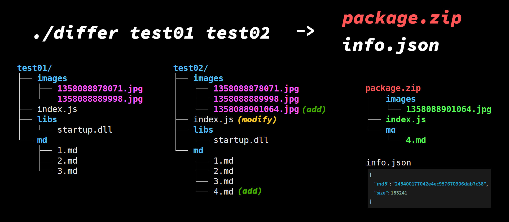

# Differ



A fast Rust tool to compare two directories and generate incremental update packages (*package.zip* + *info.json*).


## Usage

Clone

```bash
git clone https://github.com/sincerefly/differ.git
```

### Basic Usage (Default XXHash64)

```bash
cd differ && cargo run test01 test02
```

### Using MD5 for Compatibility

```bash
cargo run test01 test02 -- --hash md5
```


### Command Line Options

```
Usage: differ <dirx> <diry> [--hash <md5|xxhash>]

Arguments:
  <dirx>              Base directory (old version)
  <diry>              Target directory (new version)
  --hash <algorithm>  Hash algorithm: md5 or xxhash (default: xxhash)
```

Output

```
...

> Diff Info

 + 0b279002a376ce0f index.js
 + acfa5c659f8b720e md/4.md
 + dcd978ae7fce575c images/1358088901064.jpg

> Collect

   copy __package/index.js
   copy __package/md/4.md
   copy __package/images/1358088901064.jpg

> Create Package

 adding __package/images/1358088901064.jpg as images/1358088901064.jpg
 adding __package/md/4.md as md/4.md
 adding __package/index.js as index.js
   done __package written to package.zip

time spend: 16.185ms
Success!
```

Generated `info.json` with XXHash64:
```json
{"hash":"73e2f0450fce4573","hash_algorithm":"xxhash64","size":183235}
```

